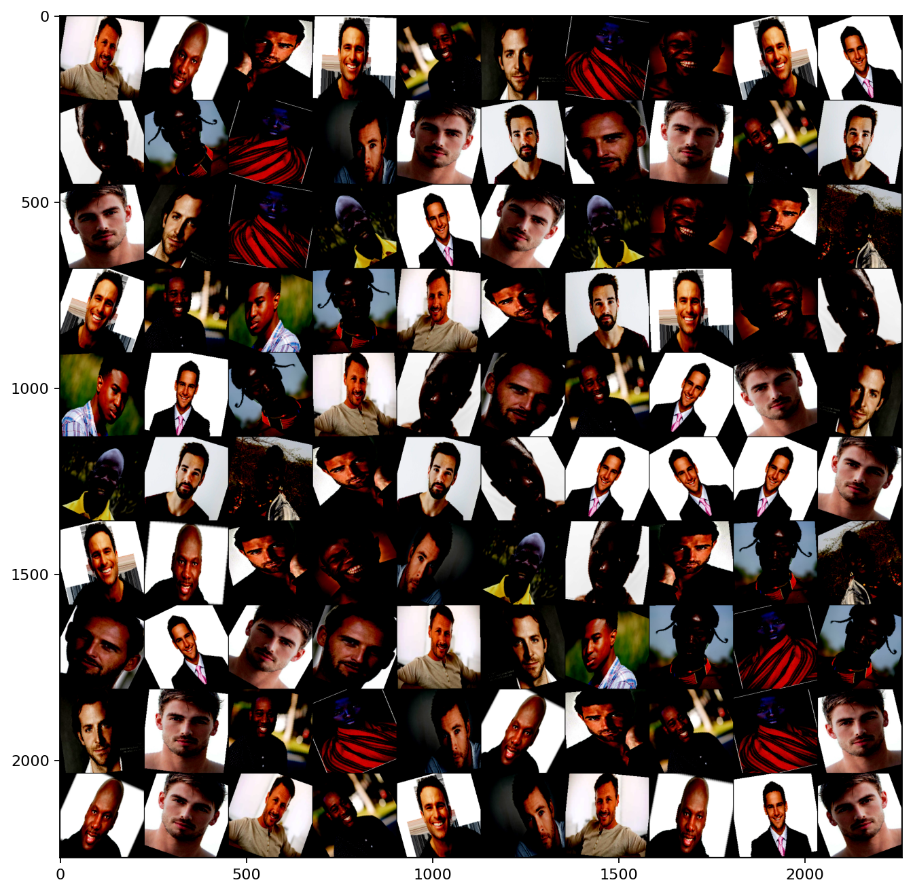
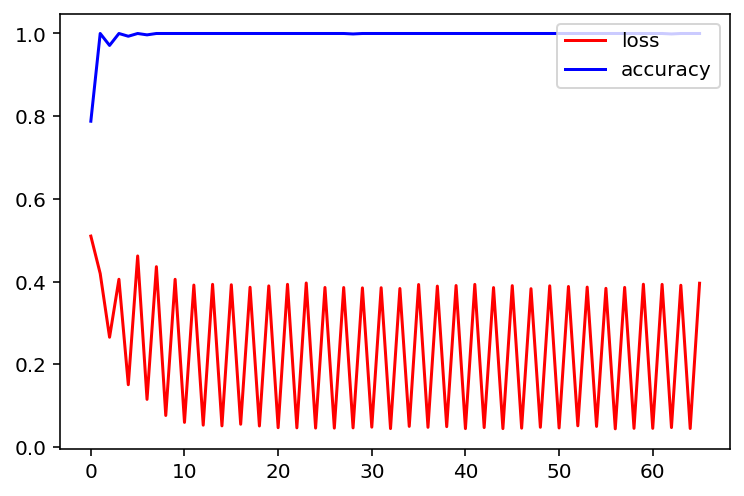
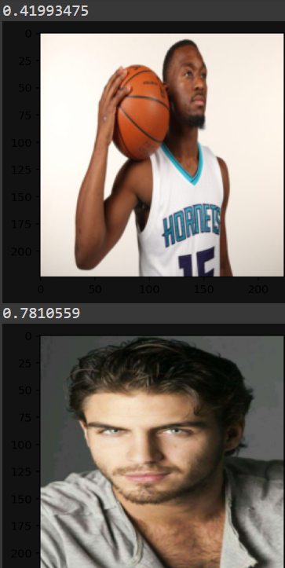

# Классификатор рас людей с использованием Pytorch на основе собственного датасета
В проекте проводится классификация изображений людей на предмет цвета кожи. Загружен датасет из 10 фотографий для каждого из 2х классов.  

Стэк библиотек:
* Pytorch
* Torchvision
* Matplotlib  

# Модель  
В качестве нейронной сети используется сеть Resnet18. ResNet18 представляют 18 слоев с весами, включая сверточный слой и полностью связанный уровень. Особенностью данной сети являются блоки, называемые соединениями быстрого доступа (shortcut connections), которые пропускают один или несколько слоев и выполняют сопоставление идентификаторов.  
Структурная схема блока Resnet:  
  

# Примеры начальных изображений:  
   

# Все изображения датасета после аугментации:  
 

# Результаты работы модели:  
 

